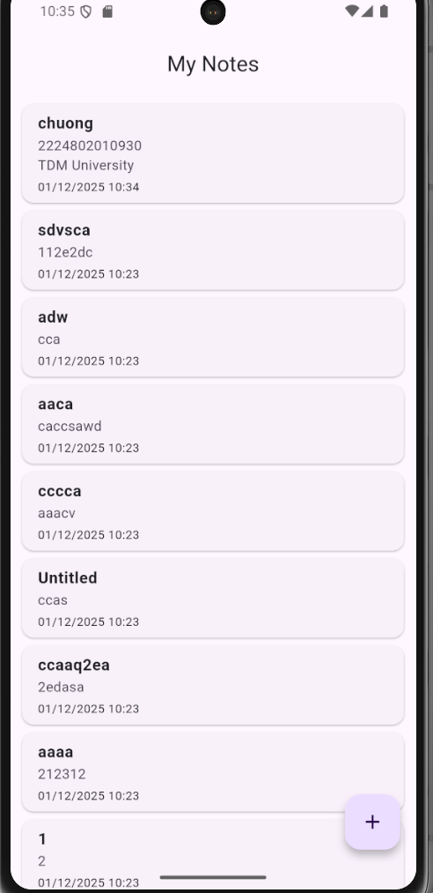
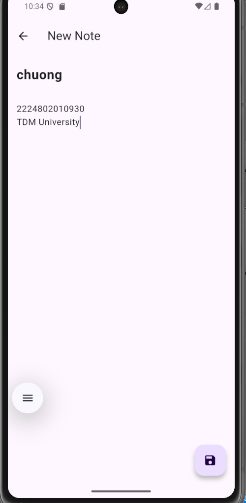
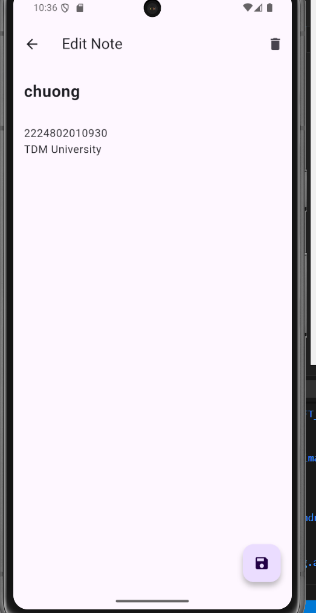
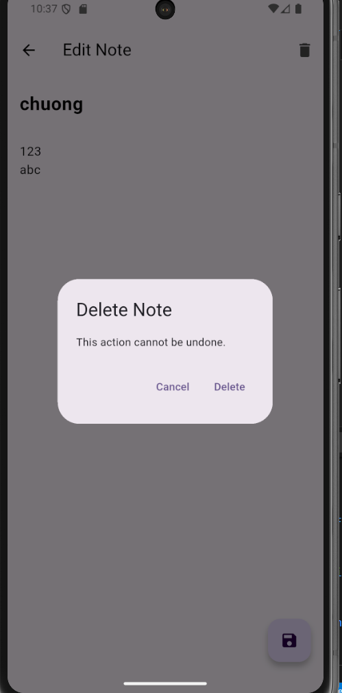

# Flutter Note App  
**Flutter + SQLite + Provider**

---

### Mô tả dự án
Flutter Note App là ứng dụng ghi chú cơ bản, được xây dựng hoàn toàn bằng **Flutter** nhằm đáp ứng đầy đủ các yêu cầu của đề tài:
- Quản lý trạng thái bằng **Provider**
- Lưu trữ dữ liệu cục bộ bằng **SQLite (sqflite)**
- Áp dụng **Singleton pattern** cho Database Helper
- Thực hiện đầy đủ **CRUD** (Create – Read – Update – Delete)
- Theo dõi **timestamp** (ngày tạo & ngày cập nhật)
- Giao diện hiện đại với **Material Design 3**

---

### Tính năng chính

| Tính năng                    | Mô tả                                                                 |
|------------------------------|-----------------------------------------------------------------------|
| Tạo ghi chú mới              | Nhập tiêu đề + nội dung, tự động lưu thời gian                        |
| Hiển thị danh sách ghi chú   | Danh sách cuộn, sắp xếp theo thời gian cập nhật mới nhất (DESC)       |
| Chỉnh sửa ghi chú            | Nhấn vào ghi chú → sửa → lưu tự động cập nhật thời gian               |
| Xóa ghi chú                  | Có dialog xác nhận trước khi xóa                                      |
| Lưu trữ vĩnh viễn            | Dữ liệu vẫn còn sau khi thoát và mở lại ứng dụng                      |
| Tự động cập nhật UI          | Sử dụng Provider → giao diện cập nhật tức thì khi dữ liệu thay đổi    |

---

###  Tech Stack & Dependencies

| Thư viện              | Mục đích                                      |
|-----------------------|-----------------------------------------------|
| flutter               | Framework chính                               |
| sqflite               | Cơ sở dữ liệu SQLite                          |
| path_provider         | Lấy đường dẫn lưu trữ thiết bị                |
| path                  | Xử lý đường dẫn                               |
| provider              | Quản lý trạng thái (ChangeNotifier)           |
| intl                  | Định dạng ngày giờ (dd/MM/yyyy HH:mm)         |
| cupertino_icons       | Icon mặc định                                 |

---

### Cấu trúc thư mục

```
lib/
├── main.dart                     → Entry point + ChangeNotifierProvider
├── models/
│   └── note.dart                 → Model Note (id, title, content, timestamps)
├── database/
│   └── db_helper.dart            → Singleton + CRUD async methods
├── providers/
│   └── note_provider.dart        → Quản lý danh sách Note & notify UI
├── screens/
│   ├── home_page.dart            → Trang chủ – danh sách ghi chú
│   └── note_editor_screen.dart   → Tạo / Sửa / Xóa ghi chú
└── widgets/
    └── note_card.dart            → Card hiển thị từng ghi chú
```

---

### Hướng dẫn cài đặt & chạy

#### Các bước thực hiện
```bash
# 1. Clone hoặc giải nén source code
Fluter create exercise_week_5
# 2. Vào thư mục dự án
cd exercise_week_5
# 3. Lấy dependencies
flutter pub get
# 4. Chạy ứng dụng
flutter run
```

---

###  Ảnh chụp màn hình 
| Màn hình chính           | Tạo ghi chú mới             |
|--------------------------|-----------------------------|
|  |  |


| Chỉnh sửa                     | Xác nhận xóa                      |
|-------------------------------|-----------------------------------|
|  |  |
---

### Đáp ứng yêu cầu đề tài

| Yêu cầu                              | Đã thực hiện                           |
|--------------------------------------|----------------------------------------|
| SQLite + sqflite                     | db_helper.dart (Singleton)             |
| Provider quản lý trạng thái          | note_provider.dart + ChangeNotifier    |
| CRUD hoàn chỉnh                      | create, readAll, update, delete        |
| Timestamp (createdAt, updatedAt)     | Lưu & hiển thị đúng định dạng          |
| Xác nhận trước khi xóa               | AlertDialog trong NoteEditorScreen     |
| Dữ liệu còn sau khi thoát app        | SQLite lưu trữ local                   |

---
